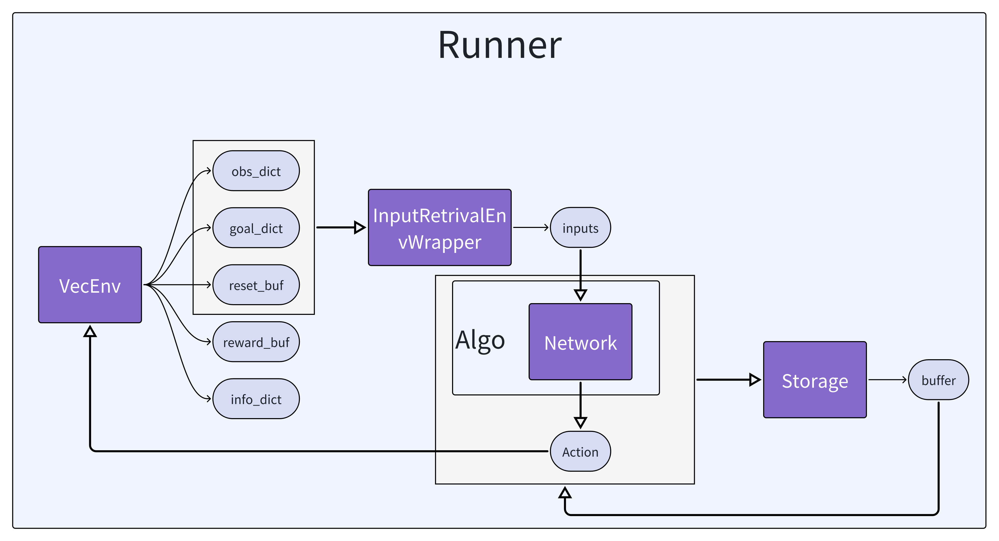
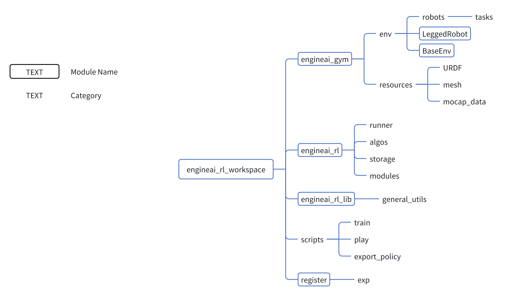
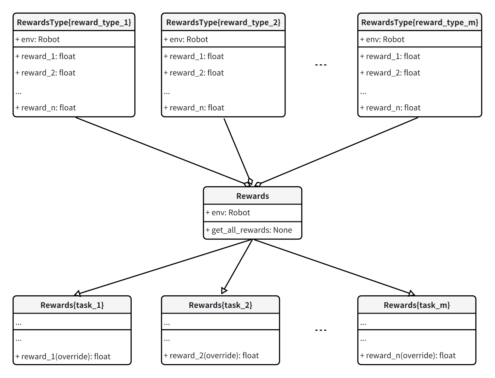
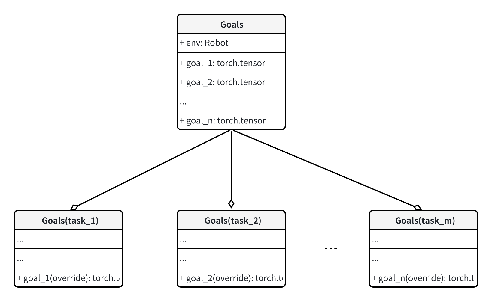
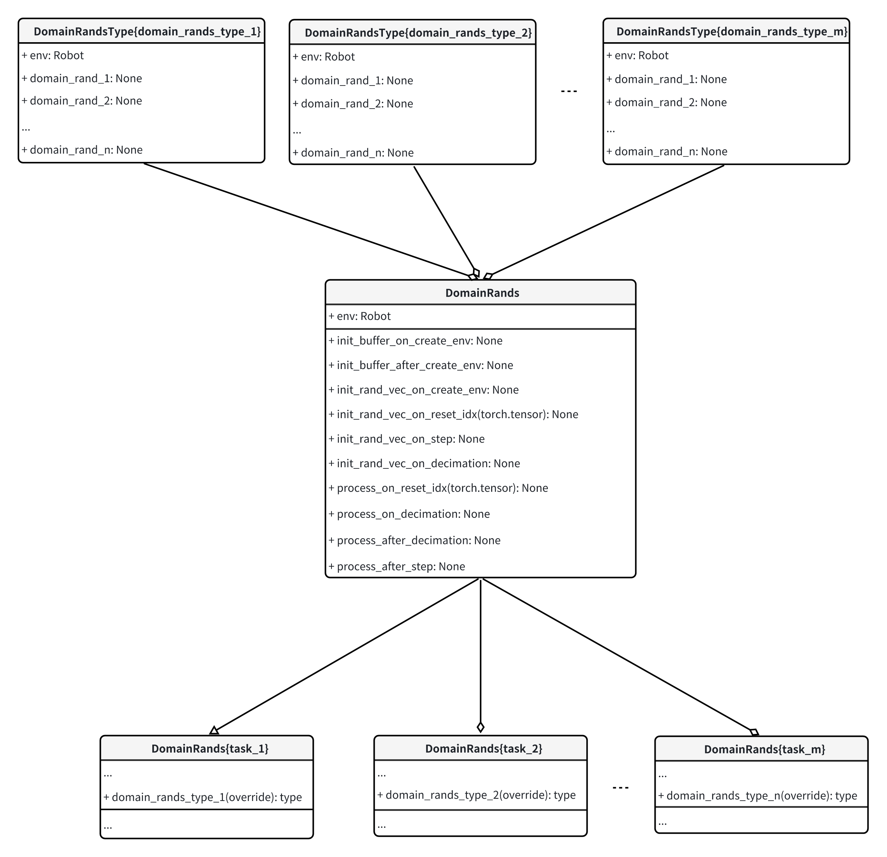
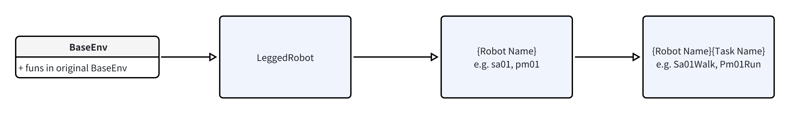
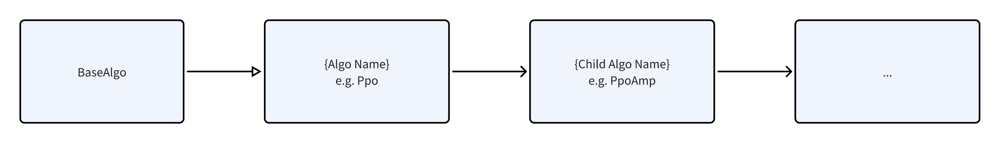
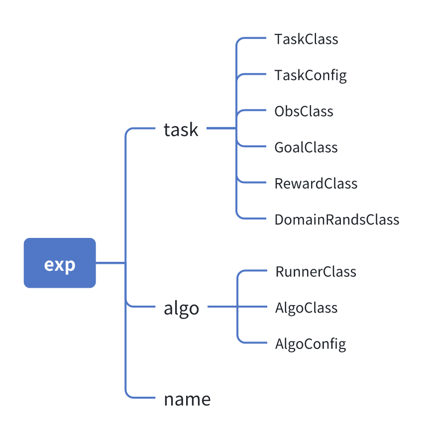

# Framework Structure

## Running process

VecEnv provides `obs_dict`, `goal_dict`, `reset_buf`, `reward_buf`, `info_dict`, where `obs_dict`, `goal_dict` are output inputs processed by the `InputRetrivalEnvWrapper`. In this way, the output of Env does not need to change with the algorithm, but `InputRetrivalEnvWrapper` generates the inputs required by the algorithm from `obs_dict` and `goal_dict`.
The inputs generated by networks and the inputs required by algo are put into storage to create a buffer, which is then used as the input to iterate model for algo. After the action enters Env, the loop is completed.

## Modules overview

`engineai_rl_workspace` includes `engineai_gym` and `engineai_rl`, and includes registry to register exp, as well as scripts to run registered exp and additional functionality.

## engineai_gym

Contains all modules related to the RL environment

### Reward

All rewards in `RewardsType{reward_type}` are integrated into class `Rewards` as base rewards. For each task, you can customize the reward to override the corresponding reward in the base rewards.

### Obs

All obs are written as methods in a single script. For each task, you can customize the obs to override the corresponding obs in the base obs.

### Goals

All goals are written as methods in a single script. For each task, you can customize the goal to override the corresponding goal in the base goals.

### Domain Rands

All domain_rands in `DomainRandsType{domain_rands_type}` are integrated into class `DomainRands` as base domain rands. For each task, you can customize domain_rand to override the corresponding domain_rand in the base domain rands.

### Env

The hierarchy of Env is shown in the figure below, including `BaseEnv`, `LeggedRobot`, `Robot`, and `Task`, where `Robot` is a specific robot and `Task` is at the next level of Robot, including the combination of a robot and a certain task, such as `Sa01Walk`, `Pm01Run`

## engineai_rl
Contains all modules related to the RL algorithm

### Algo

The algo hierarchy is shown in the figure below, including `BaseAlgo`, various RL basic algos, and more derived algos

### Runner

Runner is used for running the training and playing process including Algo and Env, where one runner can be used by different Envs and same type of Algos

### Storage

Used to store data generated by Env for training

### Modules

Including the Network, and the modules required by Algos, e.g. actor_critic

## engineai_rl_workspace

### ExpRegistry

For registering experiments (Exp)

### Composition of Exp

The logic is that each Task can be trained with a different Algo , and each Algo can also be used for different Tasks , so Task + Algo is considered an Exp
